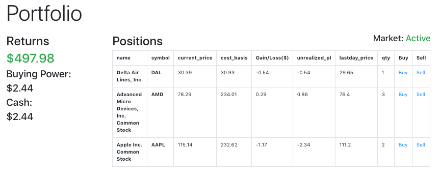

# Python Financial Investment Portfolio


## Description
Python financial investment portfolio is a dashboard application that streams and analyzes data from stock APIs

## Usage

To use run
```python manage.py runserver```


